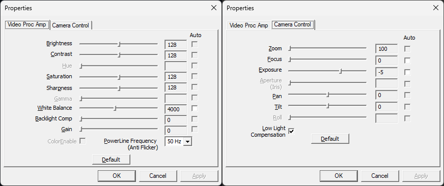

# wincamcfg

> A command-line utility for managing webcam configuration on Windows

## The Problem

Ever moved to a country with 50Hz powerline frequency and noticed your webcam footage looking like a disco strobe light? Windows defaults to 60Hz anti-flicker settings, which causes annoying flickering when your local power grid runs at 50Hz. While you *can* fix this manually in camera settings... doing it for multiple cameras or at scale is a pain.

That's where `wincamcfg` comes in!

## What It Does

`wincamcfg` is a simple command-line tool that lets you configure webcam properties programmatically. Whether you need to fix powerline frequency issues, adjust brightness and contrast, or reset all cameras to default settings, this tool has you covered.

It should be able to set the same settings as the DirectShow Native settings dilog which you may be familiar with:



## Installation

### From Source

```bash
git clone https://github.com/andrewj-t/wincamcfg.git
cd wincamcfg
cargo build --release
```

The compiled binary will be in `target/release/wincamcfg.exe`.

## Usage

### List All Cameras

See what cameras are connected to your system:

```bash
wincamcfg list
```

Example output:

```text
[0] Integrated Webcam
[1] Logitech HD Pro C920
```

### Get Current Settings

Check current property values for a specific camera:

```bash
# Get all properties for camera 0
wincamcfg get --camera 0

# Get all properties for all cameras
wincamcfg get --camera all

# Output as JSON for scripting
wincamcfg get --camera 0 --output json
```

### Fix Powerline Frequency Flickering

The main reason this tool exists! Set your cameras to match your local power grid:

```bash
# Set camera 0 to 50Hz (for most of Europe, Asia, Africa, Australia)
wincamcfg set --camera 0 --property PowerlineFrequency --value 50Hz

# Set camera 0 to 60Hz (for Americas, parts of Asia)
wincamcfg set --camera 0 --property PowerlineFrequency --value 60Hz

# Set ALL cameras to 50Hz
wincamcfg set --camera all --property PowerlineFrequency --value 50Hz
```

### Adjust Other Properties

You can configure many other camera settings:

```bash
# Adjust brightness
wincamcfg set --camera 0 --property Brightness --value 128

# Adjust contrast
wincamcfg set --camera 0 --property Contrast --value 150

# Enable auto white balance
wincamcfg set --camera 0 --property WhiteBalance --value Auto

# Disable backlight compensation
wincamcfg set --camera 0 --property BacklightCompensation --value Off
```

### Reset to Defaults

Restore factory settings:

```bash
# Reset a specific property to default
wincamcfg set --camera 0 --property Brightness --default

# Reset ALL properties on a camera to defaults
wincamcfg set --camera 0 --property all --default

# Reset ALL cameras to factory defaults
wincamcfg set --camera all --property all --default
```

## Available Properties

- `PowerlineFrequency` - Fix flickering (Disabled, 50Hz, 60Hz, Auto)
- `Brightness` - Adjust brightness levels
- `Contrast` - Adjust contrast levels
- `Hue` - Adjust colour hue
- `Saturation` - Adjust colour saturation
- `Sharpness` - Adjust image sharpness
- `Gamma` - Adjust gamma correction
- `WhiteBalance` - White balance (Auto or manual value)
- `BacklightCompensation` - Backlight compensation (On/Off)
- `Gain` - Gain/ISO control
- `colourEnable` - Enable/disable colour (On/Off)

Use `wincamcfg get --camera 0` to see which properties your specific camera supports.

## Automation & Scripting

Perfect for deployment scenarios! Use JSON output for scripting:

```powershell
# PowerShell example: Configure all cameras on startup
wincamcfg set --camera all --property PowerlineFrequency --value 50Hz --output json
```

You can add this to startup scripts, group policies, or deployment tools to ensure consistent camera configuration across multiple machines.

## Requirements

- Windows (uses DirectShow APIs)
- Rust 2024 edition or later (for building from source)

## Release Verification

All releases include cryptographic attestations to verify authenticity and integrity:

### Binary and SBOM Attestation

Release binaries (`wincamcfg.exe`) and software bill of materials (SBOMs) are attested by GitHub Actions using build provenance. This proves they were built from the exact source code in the tagged release.

### Verifying Attestations

To verify a release, use the GitHub CLI:

```bash
# Verify the binary provenance attestation
gh attestation verify wincamcfg.exe --repo andrewj-t/wincamcfg

# Verify SBOM attestations
gh attestation verify sbom.spdx.json --repo andrewj-t/wincamcfg
gh attestation verify sbom.cyclonedx.json --repo andrewj-t/wincamcfg
```

These commands confirm that:

- The binary was built by GitHub Actions from a specific commit
- The build was triggered by a git tag corresponding to the release version
- The workflow file is from the same tagged commit (no modifications)

For more information, see the [GitHub attestations documentation](https://docs.github.com/en/authentication/managing-commit-signature-verification/about-artifact-attestations).

### Code Signing

The release binary (`wincamcfg.exe`) is currently **not code-signed** due to the costs in obtaining a code signing certificate.

If your organization requires code-signed binaries, you can use signtool to sign with an code signing certificate from your Internal CA.

## Troubleshooting

Having issues? Check out the [Troubleshooting Guide](TROUBLESHOOTING.md) for debug logging instructions and common solutions.

## Show Your Support

If this tool helped fix your flickering webcam or made your life easier, a star on GitHub would be much appreciated!

## License

MIT License - See [LICENSE](LICENSE) for details.

## Contributing

Found a bug or want to add a feature? PRs are welcome! Please include working code with your contribution.

## Testing

### Unit Tests with Mock Cameras

The project includes trait-based mocking for comprehensive unit testing without requiring physical cameras or DirectShow. This enables CI/CD pipelines to run full test suites on systems without video hardware.

#### Running Tests

```bash
# Run all tests with mock camera support
cargo test --features test-util

# Run tests without building binary
cargo test --lib --features test-util

# Run specific test
cargo test --features test-util -- mock_camera_creation
```

#### Using MockCamera in Your Tests

The `MockCamera` struct provides a testable implementation of camera device operations:

```rust
#[test]
fn test_powerline_frequency_setting() -> Result<()> {
    let mut camera = MockCamera::new(
        Some("Test Camera".to_string()),
        Some("/dev/video0".to_string()),
    );

    // Set powerline frequency to 50Hz
    camera.set_video_proc_amp_property(
        VideoProcAmpProperty::PowerlineFrequency,
        1,  // 1 = 50Hz
        false,
    )?;

    // Verify the value was set
    let props = camera.get_video_proc_amp_properties()?;
    let freq = props
        .iter()
        .find(|p| p.name == "PowerlineFrequency")
        .unwrap();
    assert_eq!(freq.current, Some(1));

    Ok(())
}
```

#### Available Mock Properties

The `MockCamera` comes pre-configured with test fixtures for:

**VideoProcAmp Properties:**
- `Brightness` (0-255, default: 128)
- `PowerlineFrequency` (0-3, where 1=50Hz, 2=60Hz)

**CameraControl Properties:**
- `Focus` (0-255, default: 128)

#### CameraDevice Trait

Both real DirectShow devices and `MockCamera` implement the `CameraDevice` trait, enabling write-once, test-anywhere property code:

```rust
pub trait CameraDevice: Clone {
    fn get_device_info(&self) -> Result<(Option<String>, Option<String>)>;
    fn get_video_proc_amp_properties(&self) -> Result<Vec<PropertyInfo>>;
    fn get_camera_control_properties(&self) -> Result<Vec<PropertyInfo>>;
    fn set_video_proc_amp_property(&mut self, property: VideoProcAmpProperty, value: i32, auto: bool) -> Result<()>;
    fn set_camera_control_property(&mut self, property: CameraControlProperty, value: i32, auto: bool) -> Result<()>;
}
```

#### Feature Flag

Mock functionality is feature-gated behind `test-util` to keep test code out of production builds:

```toml
[features]
test-util = []
```

When `test-util` is disabled (default), `MockCamera` is not compiled. This follows Microsoft Rust guideline M-TEST-UTIL.
