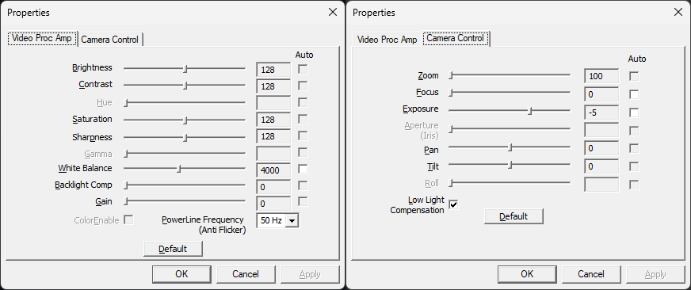

# wincamcfg

> A command-line utility for managing webcam configuration on Windows

## The problem

Ever moved to a country with 50Hz powerline frequency and noticed your webcam footage looking like a disco strobe light? Windows defaults to 60Hz anti-flicker settings, which causes annoying flickering when your local power grid runs at 50Hz. While you *can* fix this manually in camera settings... doing it for multiple cameras or at scale is a pain.

That's where `wincamcfg` comes in.

## What it does

`wincamcfg` lets you read and write webcam properties from the command line. The original use case was fixing powerline-frequency flicker on cameras moved between 50Hz and 60Hz countries, but the same approach works for brightness, contrast, white balance, and the rest of the DirectShow property set.

It can set the same things as the native DirectShow camera-properties dialog:



## Installation

### From source

```bash
git clone https://github.com/andrewj-t/wincamcfg.git
cd wincamcfg
cargo build --release
```

The compiled binary will be in `target/release/wincamcfg.exe`.

## Usage

### List all cameras

See what cameras are connected to your system:

```bash
wincamcfg list
```

Example output:

```text
[0] Integrated Webcam
[1] Logitech HD Pro C920
```

### Get current settings

Check current property values for a specific camera:

```bash
# Get all properties for camera 0
wincamcfg get --camera 0

# Get all properties for all cameras
wincamcfg get --camera all

# Output as JSON for scripting
wincamcfg get --camera 0 --output json
```

### Fix powerline-frequency flickering

The main reason this tool exists! Set your cameras to match your local power grid:

```bash
# Set camera 0 to 50Hz (for most of Europe, Asia, Africa, Australia)
wincamcfg set --camera 0 --property PowerlineFrequency --value 50Hz

# Set camera 0 to 60Hz (for Americas, parts of Asia)
wincamcfg set --camera 0 --property PowerlineFrequency --value 60Hz

# Set ALL cameras to 50Hz
wincamcfg set --camera all --property PowerlineFrequency --value 50Hz
```

### Adjust other properties

Other settings you can change:

```bash
# Adjust brightness
wincamcfg set --camera 0 --property Brightness --value 128

# Adjust contrast
wincamcfg set --camera 0 --property Contrast --value 150

# Enable auto white balance
wincamcfg set --camera 0 --property WhiteBalance --value Auto

# Disable backlight compensation
wincamcfg set --camera 0 --property BacklightCompensation --value Off
```

### Auto vs manual mode

Properties like `Exposure`, `Focus`, and `WhiteBalance` can run in either Auto or Manual mode. Pass `--value Auto` to switch the property into auto mode, or pass any numeric value to switch it into manual mode at that value.

```bash
# Turn auto exposure ON
wincamcfg set --camera 0 --property Exposure --value Auto

# Turn auto exposure OFF by setting an explicit manual value
# (use `get` to see the supported range and current value, e.g. -11..-1 on a C920)
wincamcfg set --camera 0 --property Exposure --value -5

# Same idea for autofocus
wincamcfg set --camera 0 --property Focus --value Auto    # autofocus on
wincamcfg set --camera 0 --property Focus --value 0       # autofocus off, fixed focus
```

The current mode is shown in square brackets by `get`, e.g. `Exposure: -5 [Manual]` or `Exposure: -6 [Auto]`. Only properties that advertise Auto support will show a mode tag.

Every write is read back through a fresh handle, so `set` reports whether the camera kept the value, only stored it for its next start, or dropped it (exit code 2). [TROUBLESHOOTING.md](TROUBLESHOOTING.md) explains each outcome.

From an elevated prompt (which is how startup scripts and GPO usually run), add `--restart-device` to have `set` restart the camera when a value was only stored, so it takes effect immediately:

```powershell
wincamcfg set --camera 0 --property PowerlineFrequency --value 50Hz --restart-device
```

The restart takes a second or two and interrupts any application currently using that camera, which is why it is opt-in. Cameras that apply the value straight away are never restarted.

### Reset to defaults

Restore factory settings. Properties that support Auto go back to Auto, as the Default button in the Windows dialog does:

```bash
# Reset a specific property to default
wincamcfg set --camera 0 --property Brightness --default

# Reset ALL properties on a camera to defaults
wincamcfg set --camera 0 --property all --default

# Reset ALL cameras to factory defaults
wincamcfg set --camera all --property all --default
```

With `--camera all`, a device that does not support the requested property (a virtual camera, say) is skipped with a notice; with a specific index it is an error.

### Open the driver's own dialog

To see exactly what Windows shows for a camera (the same "Video Proc Amp" and "Camera Control" pages OBS Studio opens under *Configure Video*), open the driver's property dialog for one camera:

```bash
wincamcfg dialog --camera 0
```

The command blocks until the dialog is closed. Changes made there are written by the driver's own page; use `get` afterwards to confirm them.

## Available properties

- `PowerlineFrequency` - Fix flickering (Disabled, 50Hz, 60Hz, Auto)
- `Brightness` - Adjust brightness levels
- `Contrast` - Adjust contrast levels
- `Hue` - Adjust colour hue
- `Saturation` - Adjust colour saturation
- `Sharpness` - Adjust image sharpness
- `Gamma` - Adjust gamma correction
- `WhiteBalance` - White balance (Auto or manual value)
- `BacklightCompensation` - Backlight compensation (On/Off)
- `Gain` - Gain/ISO control
- `ColorEnable` - Enable/disable colour (On/Off)
- `Exposure`, `Focus`, `Zoom`, `Pan`, `Tilt`, `Roll`, `Iris` - Camera control properties (Auto or manual value where supported)

Property names are matched case-insensitively.

Use `wincamcfg get --camera 0` to see which properties your specific camera supports.

## Automation and scripting

Use `--output json` for machine-readable output:

```powershell
# PowerShell example: Configure all cameras on startup
wincamcfg set --camera all --property PowerlineFrequency --value 50Hz --output json
```

Drop this into a startup script or GPO if you need every machine on a fleet to land on the same camera config.

### Exit codes

| Code | Meaning |
|------|---------|
| 0 | Success |
| 1 | Usage error, or the camera enumeration itself failed |
| 2 | `set` ran, but at least one property write failed (see the output for which) |

Diagnostics go to stderr, so `--output json` on stdout stays parseable even with `RUST_LOG` set.

## Requirements

- Windows 10 or 11 (uses DirectShow APIs)
- To build from source: Rust 1.88 or later (`rust-version` in `Cargo.toml`). `rust-toolchain.toml` pins the exact compiler that CI and releases use; `rustup` picks it up automatically.

Check the installed version with `wincamcfg --version`.

## Release verification

Every release ships with a build-provenance attestation for `wincamcfg.exe` and two SBOM attestations (SPDX and CycloneDX) that bind the published SBOMs to that binary, all generated by GitHub Actions. They prove the artifact was built from the tagged commit and not swapped out afterwards.

Verify with the GitHub CLI. All three checks take the binary as the subject; the SBOM attestations are statements about the binary and are selected by predicate type:

```bash
gh attestation verify wincamcfg.exe --repo andrewj-t/wincamcfg
gh attestation verify wincamcfg.exe --repo andrewj-t/wincamcfg --predicate-type https://spdx.dev/Document
gh attestation verify wincamcfg.exe --repo andrewj-t/wincamcfg --predicate-type https://cyclonedx.org/bom
```

A successful verification ties the binary to the GitHub Actions run that produced it, the git tag that triggered the run, and the workflow file as it existed at that commit.

See the [GitHub attestations documentation](https://docs.github.com/en/authentication/managing-commit-signature-verification/about-artifact-attestations) for details.

### Code signing

The release binary is **not code-signed**. Code-signing certificates aren't free and this is a side project. If your organization requires signed binaries, you can sign with `signtool` using your internal CA's certificate.

## Troubleshooting

Having issues? Check out the [Troubleshooting Guide](TROUBLESHOOTING.md) for debug logging instructions and common solutions.

## License

MIT. See [LICENSE](LICENSE).

## Security

See [SECURITY.md](SECURITY.md) for how to report a vulnerability privately.

## Contributing

Bug reports and PRs welcome. Before opening a PR run `cargo fmt --all`, `cargo clippy --all-targets -- -D warnings` and `cargo test`; CI enforces all three. For bugs, please include a reproduction case: camera model, the exact command you ran, and a trace log if you can get one. [TROUBLESHOOTING.md](TROUBLESHOOTING.md) covers how to capture the log.

### Code layout

- `src/main.rs`: clap definitions, entry point, exit codes.
- `src/commands.rs`: one handler per subcommand.
- `src/output.rs`: result rows and their text and JSON rendering.
- `src/webcam.rs`: COM session, device enumeration, property reads and writes with read-back verification, device restart, the driver's dialog. The only module that calls Windows.
- `src/webcam/property.rs`: property identifiers, modes, labels and value parsing. No Windows calls, so it carries most of the unit tests.

Unit tests sit next to the code they cover and need no camera. Nothing that touches COM is unit-tested, so check `list`, `get` and `set` against a real camera after changing `src/webcam.rs`.
