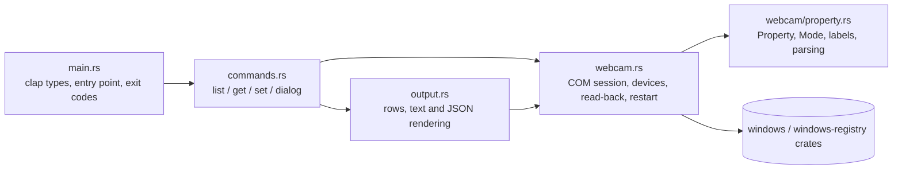
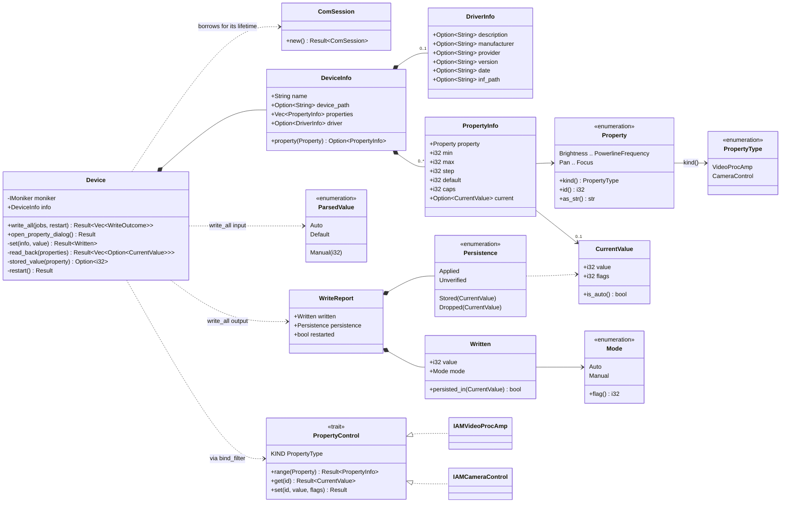
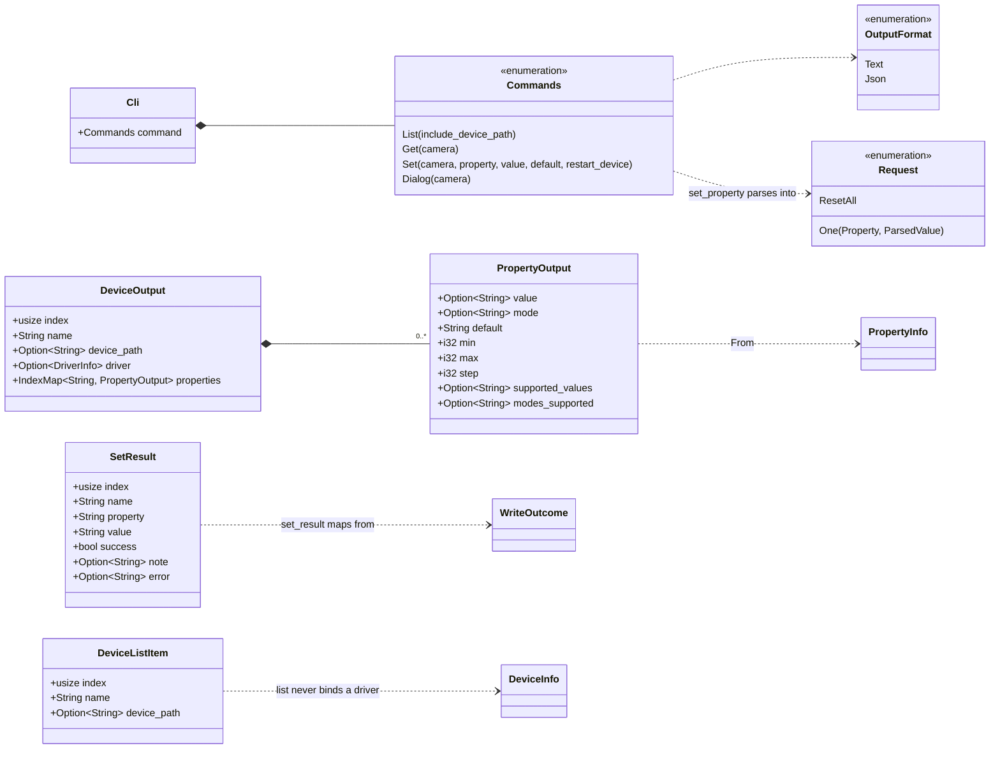
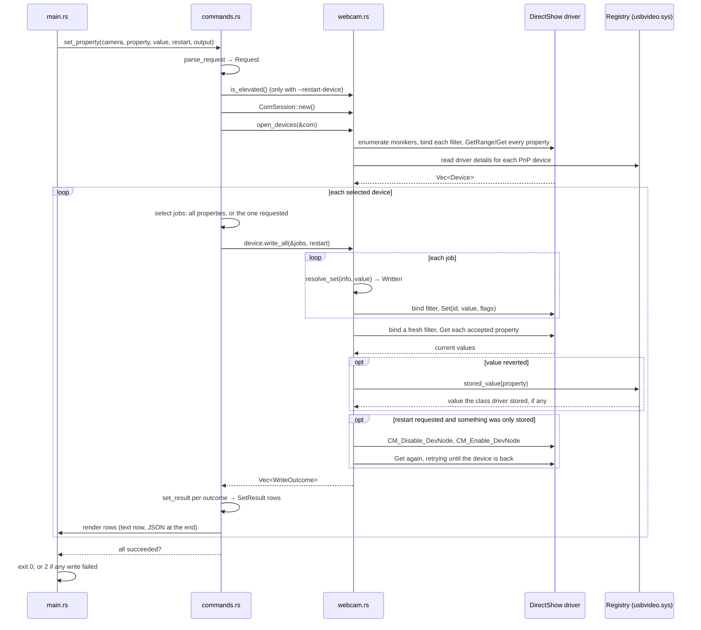
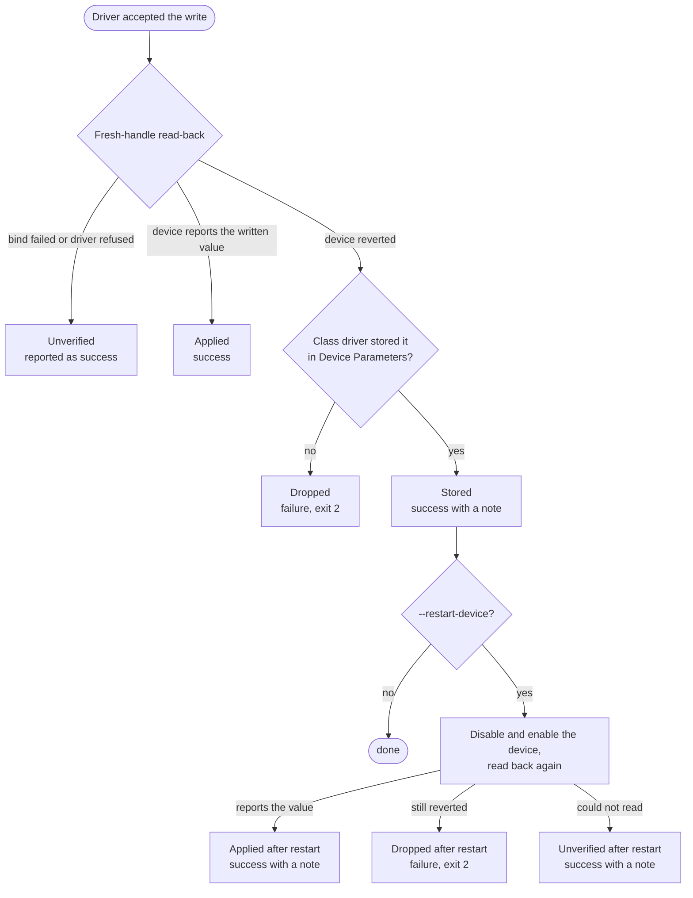

# Architecture

How the pieces of wincamcfg fit together. The diagrams are Mermaid and render on GitHub; the source of truth is the code and its module docs, so if a diagram and the code disagree, the code wins.

## Modules

Five source files. `main.rs` parses the command line and picks a handler; `commands.rs` runs one subcommand; `output.rs` turns results into text or JSON; `webcam.rs` is the only module that calls Windows; `webcam/property.rs` is pure logic with no Windows imports.

Arrows mean "uses". `webcam.rs` re-exports everything from `property.rs`, so the other modules refer to `webcam::Property` and never name the submodule.

## Device model (`webcam.rs` and `webcam/property.rs`)

`ComSession` is the proof that COM is initialised on this thread. Every `Device` borrows it, so the borrow checker guarantees no COM interface outlives the session. A `Device` holds the DirectShow moniker (the handle used to bind the driver) and a `DeviceInfo`, which is plain data. Each `PropertyInfo` describes one property the device reported, keyed by the `Property` enum. `DriverInfo` is what the registry says about the bound driver, read once at enumeration for devices that have a PnP path.

`WriteOutcome` is `Result<WriteReport>`: an `Err` means the driver rejected the write, an `Ok` carries what was sent and what the read-back showed.

`PropertyControl` exists because `IAMVideoProcAmp` and `IAMCameraControl` have identical `GetRange`/`Get`/`Set` signatures. One macro implements it for both, and `Property::kind()` says which one to cast the bound filter to.

## Command-line and output types (`main.rs`, `commands.rs`, `output.rs`)

`Cli` and `Commands` are the clap derive types; `list`, `get` and `set` also take `--output`. `Request` is what `set` resolves the `--property` and `--value` arguments into before touching any device. The three output structs are serialised directly for `--output json` and rendered by hand for text; every value in them is already a formatted string, so both formats show the same labels.

## What `set` does

The interesting command. Everything above the `webcam` lane is plain Rust; everything below it is COM.

## How a write is classified

After the driver accepts a write, `write_all` reads the property back through a fresh handle and decides what happened. This is the logic behind the notes and errors `set` prints, and behind the `--restart-device` flag.

A `Stored` outcome cannot occur after a restart: at that point the stored-value check is skipped, because a value the device still does not report has been dropped.

## Where things are tested

`webcam/property.rs`, `output.rs` and `commands.rs` carry unit tests for parsing, formatting, `resolve_set`, the persistence check and the outcome-to-row mapping; `main.rs` tests the clap definitions. Nothing that touches COM has a unit test. `list`, `get` and `set` are checked by hand against a real camera, and the `dialog` subcommand shows the driver's own property pages as the reference for what correct looks like.
